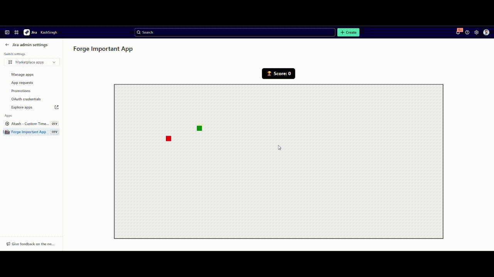

# Forge Snake Game

A fun **Snake game** built as an [Atlassian Forge](https://developer.atlassian.com/platform/forge) app.  
This app embeds a playable Snake game directly on a Jira **Admin** page, demonstrating how to combine Forge custom UI with client-side JavaScript.

## Requirements

- An [Atlassian Cloud site](https://developer.atlassian.com/platform/forge/set-up-forge/#create-an-atlassian-cloud-development-site)
- [Forge CLI](https://developer.atlassian.com/platform/forge/set-up-forge/) installed and authenticated
- Node.js ≥ 18 and npm

## Quick Start

1. **Install root dependencies**

   ```bash
   npm install
   ```

2. **Install UI dependencies**

   ```bash
   cd static/snake-game
   npm install
   ```

3. **Modify or enhance the game**  
   Edit source files in `static/snake-game/src/` to customize gameplay, UI, or styling.

4. **Build the UI**

   ```bash
   npm run build
   ```

5. **Deploy to Forge**

   ```bash
   forge deploy
   ```

6. **Install on your Atlassian site**
   ```bash
   forge install
   ```
   Choose the Jira site and product where you want the game to appear.

### Tips

- Run `forge deploy` whenever you make code changes.
- Once installed, your site automatically reflects new deployments—no need to reinstall.

## Demo



## Support

For questions or feedback, see [Forge Support](https://developer.atlassian.com/platform/forge/get-help/).
